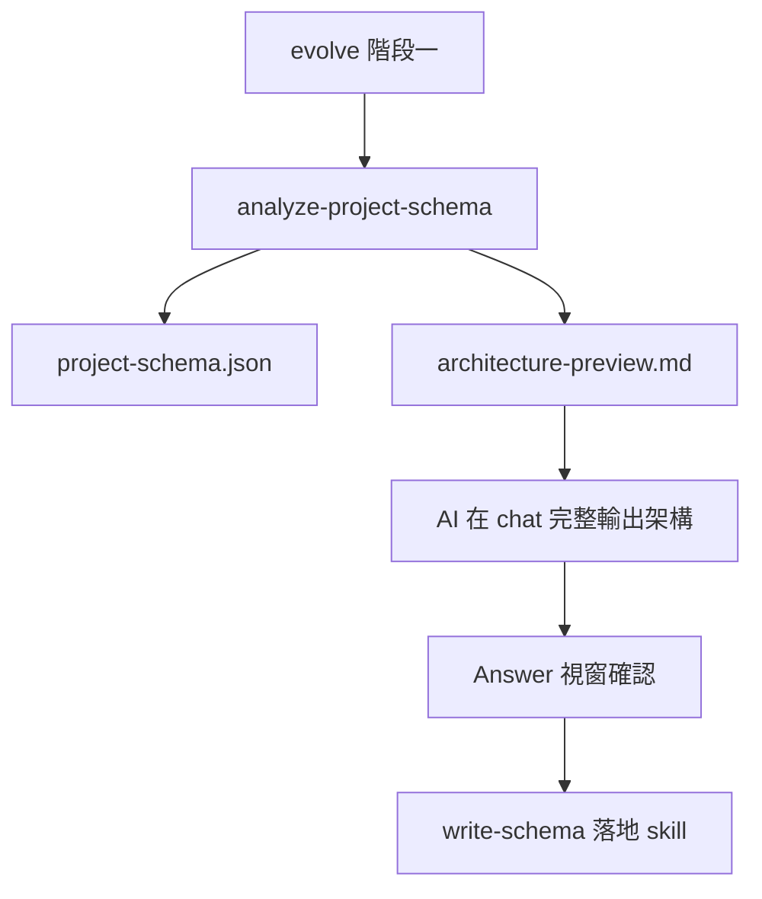

## analyze-project-schema - 專案模塊架構 LLM 分析

此指令將**目前專案**（目錄結構、檔案清單、`adapt.json` 等）提交給 LLM 分析，生成或更新專案根目錄的 `project-schema.json`。

**前置條件**：專案根目錄必須已有 `adapt.json`。若尚未執行，請先跑 `adapt`。

**預設模型**：`gpt-5.3-codex`

**產物**（相對於目標專案根目錄）：

| 產物 | 路徑 | 說明 |
|---|---|---|
| 模塊架構資料 | `project-schema.json` | LLM 分析結果（若不存在則新建） |
| 架構預覽 | `architecture-preview.md` | 預設自動生成，供 chat 呈現與查閱 |

> 不使用 `.evolve-tmp/` 暫存目錄；所有產物直接寫入專案根目錄。

---

## 1) 執行方式

在目標專案（已掛載 Pantheon）：

```bash
node .cursor/scripts/utilities/run-pantheon-script.mjs utilities/evolve.mjs analyze-project-schema
```

若在 Pantheon repo 本身：

```bash
pnpm run analyze-project-schema
```

### 常用參數

```bash
# 限制分析目錄（預設：整個專案）
node .cursor/scripts/utilities/run-pantheon-script.mjs utilities/evolve.mjs analyze-project-schema -- --dirs="src,.cursor"

# 限制送進 LLM 的檔案數量（預設：400）
node .cursor/scripts/utilities/run-pantheon-script.mjs utilities/evolve.mjs analyze-project-schema -- --max-files=300

# 指定模型（預設：gpt-5.3-codex）
node .cursor/scripts/utilities/run-pantheon-script.mjs utilities/evolve.mjs analyze-project-schema -- --model=gpt-5.3-codex

# 僅生成 project-schema.json，不自動 render-preview
node .cursor/scripts/utilities/run-pantheon-script.mjs utilities/evolve.mjs analyze-project-schema -- --skip-preview=true

# JSON 輸出（含 previewContent，供 agent 直接貼入 chat）
node .cursor/scripts/utilities/run-pantheon-script.mjs utilities/evolve.mjs analyze-project-schema -- --format=json
```

---

## 2) 行為說明

| 情境 | 行為 |
|---|---|
| 專案尚無 `project-schema.json` | LLM 依專案現況分析並於根目錄新建 |
| 專案已有 `project-schema.json` | 將現有 schema 與專案現況一併提交 LLM，重新分析並更新 |
| 執行完成（預設） | 寫入 `project-schema.json` 後自動執行 `render-preview` |
| `render-preview` 輸出 | 終端印出 `--- architecture-preview ---` 區塊，**AI 必須完整貼入 chat** |

---

## 3) 與 evolve 的關係

`evolve` 階段一**必須**透過本指令生成 `project-schema.json`，確保單獨執行與 evolve 流程行為一致：



**禁止**：evolve 階段一繞過本指令，改由 AI 手動組裝 schema 後直接 `write-schema-draft`。

---

## 4) evolve 階段一後續步驟（引用）

用戶確認架構後，執行：

```bash
node .cursor/scripts/utilities/run-pantheon-script.mjs utilities/evolve.mjs write-schema -- --input-file="./project-schema.json"
```

詳見 `.cursor/commands/utilities/evolve.md` 階段一 SOP。

---

## 5) 環境依賴

| 功能 | 依賴 |
|---|---|
| 基礎分析 | 本地 git、專案原始碼 |
| repo 知識 | `adapt.json`（需先執行 `adapt`） |
| LLM 分析 | `OPENAI_API_KEY` 或 `CUSTOM_OPENAI_API_URL` |

環境變數（可選）：

- `EVOLVE_SCHEMA_MODEL`：覆寫預設模型
- `EVOLVE_LLM_PROVIDER`：`openai` 或 `api-domain`
