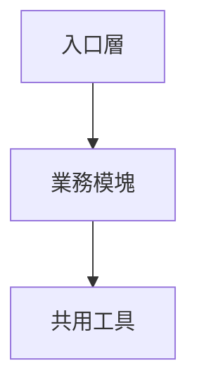
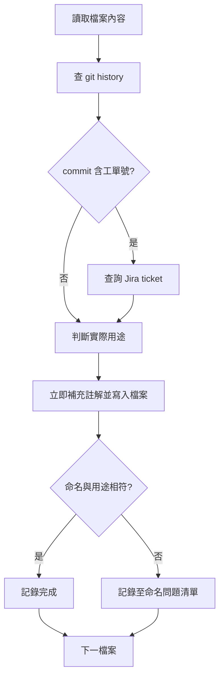
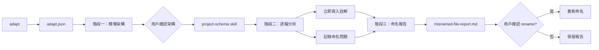

## evolve - Operator Agent 生態演化

此指令在 `adapt` 完成 repo 知識庫落地化之後執行，目標是將專案改造成適合 Operator Agent 操作的生態。

**前置條件**：專案根目錄必須已有 `adapt.json`（含 `coding-standard`、`git-flow`、`labels` 等區塊）。若尚未執行，請先跑 `adapt`。

**適合 Operator Agent 的生態特徵**：

1. 專案內容有足夠註解與說明，協助不同 LLM 分析專案時不會因 model 等級而有太大結果落差
2. 檔案命名與實際用途相符，且開發方式符合標準程式設計流程與專案自身的 coding standard / project coding style

**Pantheon 提供（掛載至目標專案）**：

| 類型 | 路徑 | 說明 |
|---|---|---|
| 指令 | `.cursor/commands/utilities/evolve.md` | 三階段 SOP |
| 腳本 | `.cursor/scripts/utilities/evolve.mjs` | 輔助工具（check-prereq、file-history、write-schema 等） |

**目標專案運作後產生（不在 Pantheon repo 內）**：

| 產物 | 路徑（相對於目標專案根目錄） | 說明 |
|---|---|---|
| 模塊架構 skill | `.cursor/skills/project-schema/SKILL.md` | 階段一確認後由 `write-schema` 生成 |
| 命名報告 | `misnamed-file-report.md` | 階段三由 `write-report` 生成 |
| 分析暫存 | `.evolve-tmp/` | 進度、schema 草稿、rename plan 等（應加入目標專案 `.gitignore`） |

> **重要**：`project-schema` skill 與 `.evolve-tmp/` 皆為 evolve 在**目標專案**執行時的落地產物，Pantheon 本身不預先包含這些檔案。

---

## 0) 前置檢查

當用戶輸入 `evolve` 時，AI **必須**先確認 `adapt.json` 存在且可讀：

```bash
node .cursor/scripts/utilities/run-pantheon-script.mjs utilities/evolve.mjs check-prereq
```

若在 Pantheon repo 本身：

```bash
pnpm run evolve -- check-prereq
```

若 `adapt.json` 不存在或過舊，**停止 evolve 流程**，提示用戶先執行 `adapt`。

讀取 `adapt.json` 時，至少參考：

- `coding-standard`：註解格式、命名慣例、目錄結構規則
- `git-flow`：分支命名、commit 格式、工單號模式
- `labels`：模塊/功能領域標籤（輔助同質性分類）

---

## 1) 階段一：模塊架構分析與 project-schema 落地

### 1.1 閱讀專案並分析模塊

AI 應系統性閱讀專案原始碼與設定檔，依**同質性**（職責、依賴方向、目錄慣例、命名前綴）分析模塊架構。

輔助列出可分析檔案：

```bash
node .cursor/scripts/utilities/run-pantheon-script.mjs utilities/evolve.mjs list-files
```

可選參數：

```bash
# 限制目錄
node .cursor/scripts/utilities/run-pantheon-script.mjs utilities/evolve.mjs list-files -- --dirs="src,.cursor"

# 輸出 JSON
node .cursor/scripts/utilities/run-pantheon-script.mjs utilities/evolve.mjs list-files -- --format=json
```

### 1.2 在 chat 呈現架構圖並與用戶確認

**必須**在 chat 輸出以下內容，並使用 **Answer 選項視窗**等待用戶確認：

#### 結構總覽表

| 模塊 | 路徑範圍 | 職責 | 主要依賴 |
|---|---|---|---|
| （依分析填寫） | | | |

#### 模塊定義表

| 模塊 ID | 顯示名稱 | 邊界定義 | 不應包含 |
|---|---|---|---|
| （依分析填寫） | | | |

#### Mermaid 架構圖



#### 確認選項

- **選項 A**：架構正確，進入階段二
- **選項 B**：需調整（請用戶補充修正意見）
- **選項 C**：取消 evolve 流程

### 1.3 生成 project-schema skill

用戶確認後，AI 組裝 schema JSON 並落地 skill：

```bash
node .cursor/scripts/utilities/run-pantheon-script.mjs utilities/evolve.mjs write-schema -- --input-file="./.evolve-tmp/project-schema.json"
```

`project-schema.json` 結構：

```json
{
  "projectName": "專案名稱",
  "summary": "1-3 句專案摘要",
  "modules": [
    {
      "id": "module-id",
      "name": "模塊顯示名稱",
      "paths": ["src/modules/foo"],
      "responsibility": "模塊職責說明",
      "boundaries": "邊界定義：不應包含的內容",
      "dependencies": ["other-module-id"]
    }
  ],
  "entryPoints": ["src/index.ts"],
  "conventions": {
    "naming": "命名慣例摘要（來自 adapt.json coding-standard）",
    "commentStyle": "註解風格摘要"
  }
}
```

落地至**目標專案**（腳本會同步多處）：

- `.cursor/skills/project-schema/SKILL.md`
- `.agents/skills/project-schema/SKILL.md`（若目標專案有 `.agent/` 也會同步）

`write-schema` 使用 `getProjectRoot()` 判斷目標專案根目錄，確保產物寫入執行 evolve 的專案，而非 Pantheon 掛載目錄。

---

## 2) 階段二：逐檔分析、註解補全與命名檢查

依 `project-schema` 的模塊定義，**逐模塊、逐檔案**執行分析。

**核心原則**：

| 動作 | 時機 | 是否需要用戶確認 |
|---|---|---|
| 補充註解（檔案頂部、函式、物件、常數） | 單檔分析完成後**立即寫入** | ❌ 不需要 |
| 記錄命名問題 | 分析過程中同步記錄 | ❌ 不需要 |
| 重新命名檔案 | 全部檔案分析完成後 | ✅ 需要（階段三） |

### 2.1 單檔處理流程

每個檔案依序執行，**分析與註解寫入在同一輪完成**：



### 2.2 命名與用途核對原則

**預設假設**：原始檔案命名可能有問題。核對方式：

1. 閱讀檔案內容，判斷實際用途
2. 查閱該檔案 git history 的 commit message
3. 若 commit message 含工單號（如 `FE-1234`、`IN-5678`、`AI-320`），連帶查詢 Jira ticket
4. 宣告級註解（尤其 `@external`）必須以「宣告來源 commit」為準，不可直接套用檔案層級票號池

查詢單檔 git history：

```bash
node .cursor/scripts/utilities/run-pantheon-script.mjs utilities/evolve.mjs file-history -- --path="src/foo/bar.ts" --max=30
```

查詢宣告來源（推薦，用於 `@external`）：

```bash
node .cursor/scripts/utilities/run-pantheon-script.mjs utilities/evolve.mjs declaration-history -- --path="src/foo/bar.ts" --signature="const foo ="
```

查詢 Jira（有工單號時）：

```bash
pnpm run read-jira-ticket -- --ticket=FE-1234
```

### 2.3 註解補全規則

完成單檔分析後，依專案 `coding-standard` **立即**補充註解並寫入檔案（不需等待用戶確認）：

| 目標 | 要求 |
|---|---|
| 檔案頂部 | 在檔案最上方添加區塊註解，描述檔案用途、所屬模塊、關聯工單（若有）；**禁止空白 `/** */`** |
| 函式 | 說明用途、參數、回傳值；有工單則標註 |
| 物件 / 常數 | 說明用途與使用情境；有工單則標註 |
| 既有 skill 格式 | 若專案已有註解/skill 規範，**先**依專案格式，再在下方補檔案用途 |

`@external` 規則（強制）：

1. 使用 declaration-level 來源 commit（`declaration-history`）萃取 tickets
2. 僅保留來源 commit 中的 ticket；若無 ticket，**省略 `@external`**
3. 同一個 JSDoc block 內 `@external` 不可重複
4. 遇到 noise commit（例如全檔 lint/format、`update`）不可直接當來源

**工單註解格式範例**（依專案慣例調整）：

```javascript
/**
 * @ticket FE-1234 - 修正 XXX 流程
 * @purpose 處理 YYY 情境的資料轉換
 */
```

```typescript
// [FE-1234] 使用者權限檢查：驗證 token 有效性
```

**允許行為**：

- ✅ 分析完成後直接寫入註解（檔案頂部、函式、物件、常數）
- ✅ 僅新增或補充缺少的註解，不改動程式邏輯

**禁止行為**：

- ❌ 註解與實際邏輯不符
- ❌ 使用模板語句（例如 `Provide declaration logic for ...`）作為最終 `@purpose`
- ❌ 刪除既有有效註解
- ❌ 在階段二修改程式邏輯（僅允許新增註解）
- ❌ 在階段二執行重新命名（重新命名統一留至階段三）

### 2.4 品質閘（Quality Gates）

階段二每批次完成後，應執行以下檢查；任一失敗需停下修復後再往下：

| Gate | 檢查內容 | 失敗處理 |
|---|---|---|
| A | Syntax gate（prettier parse / 基礎語法） | 先修復語法與 JSDoc 分隔符再繼續 |
| B | Annotation schema gate（必填欄位、去重、格式） | 補齊缺漏並移除重複 |
| C | Relevance gate（`@external` 與 declaration-origin 一致） | 回寫正確來源，無票則省略 |
| D | Safety gate（comments-only） | 若觸及 runtime logic，標記風險並回退 |
| E | Summary gate（輸出統計報告） | 產生可追溯清單供覆核 |

建議使用 `annotation-audit` 子命令執行批次稽核：

```bash
# 僅稽核（文字摘要）
node .cursor/scripts/utilities/run-pantheon-script.mjs utilities/evolve.mjs annotation-audit -- --dirs=src --format=text

# 稽核 + 安全自動修復（僅修復重複 @external 與重複分隔符）
node .cursor/scripts/utilities/run-pantheon-script.mjs utilities/evolve.mjs annotation-audit -- --dirs=src --fix=true --output-file=.evolve-tmp/annotation-audit.json
```

若要讓 Pantheon agent **自行呼叫 LLM 並直接回寫檔案註解**（不依賴 Cursor/Claude/Codex editor 內建編輯流程），使用：

```bash
# 建議先 dry-run 看安全閘結果
node .cursor/scripts/utilities/run-pantheon-script.mjs utilities/evolve.mjs run-annotation-pass -- --dirs=src --max-files=50 --dry-run=true --format=text

# 確認後執行實寫
node .cursor/scripts/utilities/run-pantheon-script.mjs utilities/evolve.mjs run-annotation-pass -- --dirs=src --max-files=50 --format=text
```

`run-annotation-pass` 內建保護：

- 以 LLM 逐檔分析用途與宣告註解
- 僅允許 comments-only 寫回（Safety Gate）
- 宣告級 `@external` 僅可使用來源 commit ticket（無票則省略）

### 2.5 單檔完成標記

每完成一檔分析，在內部追蹤表記錄：

| 欄位 | 說明 |
|---|---|
| `module` | 所屬模塊 ID |
| `path` | 檔案路徑 |
| `actualPurpose` | 實際用途 |
| `nameMatchesPurpose` | 命名是否相符 |
| `recommendedName` | 推薦名稱（若不符） |
| `tickets` | 關聯工單號陣列 |
| `commentsAdded` | 是否已補註解 |

建議將追蹤資料寫入目標專案的 `.evolve-tmp/analysis-progress.json`。

首次執行 evolve 時，AI 應確認目標專案 `.gitignore` 已包含 `.evolve-tmp/`（若無則追加）。

---

## 3) 階段三：命名報告與重新命名確認

全部檔案分析與註解補全完成後，**僅針對命名與用途不符的檔案**進行確認：

> 註解已在階段二直接寫入；階段三**只處理重新命名**，不再次詢問註解相關事項。

### 3.1 在 chat 呈現彙整表

| 模塊 | 原檔案名稱 | 實際用途 | 推薦名稱 |
|---|---|---|---|
| `module-id` | `old-name.ts` | 實際做什麼 | `new-name.ts` |

僅列出 `nameMatchesPurpose === false` 的項目；若無則明確告知「未發現命名問題」。

### 3.2 生成 misnamed-file-report

```bash
node .cursor/scripts/utilities/run-pantheon-script.mjs utilities/evolve.mjs write-report -- --input-file="./.evolve-tmp/analysis-progress.json"
```

輸出：專案根目錄 `misnamed-file-report.md`

### 3.3 詢問是否代理執行重新命名

使用 **Answer 選項視窗**：

- **選項 A**：代理執行全部重新命名（含更新 import 路徑）
- **選項 B**：僅執行部分（請用戶指定模塊或檔案）
- **選項 C**：不執行重新命名，僅保留報告
- **選項 D**：取消

若用戶選擇執行重新命名，先 dry-run：

```bash
node .cursor/scripts/utilities/run-pantheon-script.mjs utilities/evolve.mjs rename -- --input-file="./.evolve-tmp/rename-plan.json" --dry-run
```

確認無誤後執行：

```bash
node .cursor/scripts/utilities/run-pantheon-script.mjs utilities/evolve.mjs rename -- --input-file="./.evolve-tmp/rename-plan.json"
```

`rename-plan.json` 結構：

```json
{
  "renames": [
    { "from": "src/old-name.ts", "to": "src/new-name.ts" }
  ]
}
```

**重新命名注意事項**：

- 使用 `git mv` 保留 history
- 同步更新所有 import / require 路徑
- 重新命名後執行專案 lint / typecheck（若存在）
- **不**自動 commit；詢問用戶是否要 commit

---

## 4) 與 adapt 的協作關係



| 步驟 | 指令 | 產物 |
|---|---|---|
| 1 | `adapt` | `adapt.json`、pantheon-mounted-workflow skill |
| 2 | `evolve`（本指令） | `project-schema` skill、`misnamed-file-report.md`、註解補全 |

---

## 5) 執行策略與 token 管理

大型專案建議分批處理：

1. **按模塊分批**：每次處理一個模塊，完成後向用戶報告進度
2. **暫存進度**：使用 `.evolve-tmp/` 保存分析狀態，支援中斷後續跑
3. **優先順序**：入口檔 → 核心業務 → 工具函式 → 設定檔

恢復未完成的 evolve：

```bash
node .cursor/scripts/utilities/run-pantheon-script.mjs utilities/evolve.mjs status
```

---

## 6) 環境依賴

| 功能 | 依賴 |
|---|---|
| 基礎分析 | 本地 git、專案原始碼 |
| repo 知識 | `adapt.json`（需先執行 `adapt`） |
| Jira 工單查詢 | `read-jira-ticket`（`JIRA_EMAIL` + `JIRA_API_TOKEN`） |
| 重新命名 | git、專案 linter（可選） |

---

## 7) 用戶確認點摘要

| 步驟 | 需要確認 | 說明 |
|---|---|---|
| 階段一：模塊架構 | ✅ | 生成 `project-schema` 前須確認 |
| 階段二：註解補全 | ❌ | 分析完成後直接寫入 |
| 階段三：重新命名 | ✅ | 僅針對命名不符檔案，執行 rename 前須確認 |
| commit | ✅ | 不自動 commit，須詢問用戶 |

## 8) 禁止行為摘要

- ❌ 未執行 `adapt` 就開始 `evolve`
- ❌ 未經用戶確認架構就生成 `project-schema`
- ❌ 未經用戶確認就執行重新命名
- ❌ 階段二暫存註解建議但不寫入（應立即寫入）
- ❌ 註解內容與實際程式邏輯不一致
- ❌ 覆蓋用戶自訂且非 `managed-by-pantheon-evolve` 標記的 `project-schema` skill
