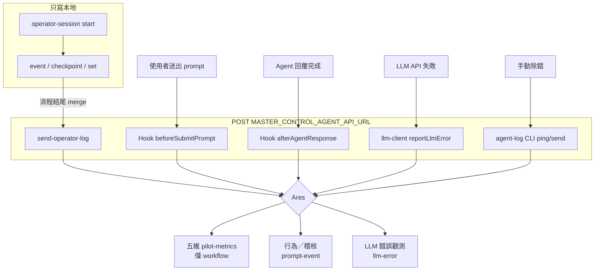

# Agent Log / Event 發送時機總覽

> **位置**：repo 根目錄 `docs/`（與 Cursor 掛載目錄 `.cursor/` 分離）。

本文整理 Pantheon（Prometheus）目前所有會（或不會）送往 Ares Log API 的 event／log，以及各自的觸發時機。

**共通前提**

| 項目 | 說明 |
|---|---|
| Endpoint | `MASTER_CONTROL_AGENT_API_URL`（舊名 `OPERATOR_AGENT_LOG_API_URL` 仍相容） |
| HTTP | `POST`，body 固定 `{ "data": <payload> }` |
| 未設定 URL | **全部 skip**，不阻斷 Cursor／Operator 主流程 |
| 不新增額外 env | Prompt Event／Workflow Contract 皆跟隨此 URL |

相關細則：

- Workflow 五維契約：[workflow-log-contract.md](./workflow-log-contract.md)（[OL-6](https://innotech.atlassian.net/browse/OL-6)）
- Prompt Event：[prompt-event.md](./prompt-event.md)（[OL-7](https://innotech.atlassian.net/browse/OL-7)）

---

## 結論：真正會 HTTP POST 的路徑

目前只有 **4 條路徑**會打到 Ares Log API：

| # | 路徑 | 觸發時機 | 頻率 | `logScope` / `category` | 進五維 cohort？ |
|---|---|---|---|---|---|
| 1 | `pnpm run send-operator-log` | Operator 流程**結尾**（成功／失敗／取消） | **每個 workflow 一筆** | `workflow` / 多為 action 名 | ✅ 是（母體） |
| 2 | Cursor Hook `beforeSubmitPrompt` | 使用者**送出 prompt 當下** | 每次送出 | `prompt` / `prompt-event` | ❌ 否 |
| 3 | Cursor Hook `afterAgentResponse` | Agent **回覆完成當下** | 每次回覆 | `prompt` / `prompt-event` | ❌ 否 |
| 4 | `llm-client` → `reportLlmError` | LLM API **失敗當下** | 每次失敗（fire-and-forget） | （預設／未強制 workflow） / `llm-error` | ❌ 否 |

另有除錯 CLI：`pnpm run agent-log`（`ping`／`send`）— 手動測試用，非日常自動路徑。

---

## 總覽表（含「只寫本地、不送 Ares」）

| 程序 / 入口 | 觸發時間點 | 是否 POST Ares | 主要內容 | 備註 |
|---|---|---|---|---|
| `operator-session --action=start` | Operator 指令**入口** | ❌ | 寫入 `.cursor/tmp/.operator-session.json`（起點時間、可選 ticket） | 供結尾算 `durationMs` |
| `operator-session --action=event` | 決策點／plan／回覆等 | ❌ | 追加 session.events | 結尾由 `send-operator-log` merge |
| `operator-session --action=checkpoint` | 對話恢復等 | ❌ | git checkpoint | 人工改碼偵測用 |
| `operator-session --action=set` | 中途補綁 ticket | ❌ | 更新 session.ticket | OL-6 |
| `send-operator-log` | 流程**結尾** | ✅ | workflow 摘要 + timing + `collaborationMetrics` + 契約欄位 | **五維分析母體** |
| Hook `prompt-event-collector`（beforeSubmitPrompt） | 使用者送出 prompt | ✅ | `eventType=user-prompt` | 不進五維 |
| Hook `prompt-event-collector`（afterAgentResponse） | Agent 回覆完成 | ✅ | `eventType=assistant-event` | 不進五維 |
| `llm-client` 錯誤上報 | LLM 請求失敗 | ✅ | `category=llm-error` | 非阻塞；失敗不影響主流程 |
| `agent-log` CLI（ping／send） | 手動 | ✅ | 測試 payload | 除錯 |
| `agent-log` CLI（show-config） | 手動 | ❌ | 只顯示設定 | 不連線 |
| Hook `notify-on-ask-question` 等 | AskQuestion 後 | ❌ | 本機系統通知 | **不是** Ares log |

---

## 1. Operator Workflow Log（五維母體）

### 時機

```text
Operator 指令開始
  → operator-session start（本地）
  → （過程）event / checkpoint（本地）
  → 流程結束（成功 / 失敗 / 取消）
  → send-operator-log（POST 一筆）
```

### 適用指令（command 要求結尾送出）

| Operator 指令 | `action` 例 | 結尾時機 |
|---|---|---|
| `start-task` | `start-task` | MR 建立完成／中止／失敗 |
| `fix-comment` | `fix-comment` | 評論處理收斂後 |
| `resolve-conflict` | `resolve-conflict` | 衝突處理結束 |
| `reverse-engineering` | `reverse-engineering` | 流程結束 |
| `tenth-person-check` | `tenth-person-check` | 檢查流程結束 |

**原則**：每個 operator 指令結尾只送 **一筆** workflow log（整段耗時），過程事件不即時上報。

### Payload 重點

| 欄位 | 來源 |
|---|---|
| `logScope=workflow` | `send-operator-log` 固定 |
| `durationMs` / `startedAt` | session 起迄（腳本保證） |
| `collaborationMetrics` | session events + git 快照彙整 |
| `ticket` / `mrUrl` / `ticketSource` | OL-6 自動推導（見 workflow-log-contract） |
| `dataQuality` | 身分／ticket／plan 缺失旗標 |
| `planMetrics.missing` | start-task 且無 plan events |

### CLI

```bash
pnpm run operator-session -- --action=start --command=start-task --ticket=OL-6
pnpm run send-operator-log -- --action=start-task --reason="mr created"
```

---

## 2. User Prompt Event（往來觀測）

### 時機

| Hook | Cursor 時機 | `eventType` |
|---|---|---|
| `beforeSubmitPrompt` | 使用者按下送出、prompt 進入 Agent 前 | `user-prompt` |
| `afterAgentResponse` | Agent 產生完整回覆後 | `assistant-event` |

註冊於 `.cursor/hooks.json` → `prompt-event-collector.mjs`。

### 行為要點

| 項目 | 說明 |
|---|---|
| 啟用 | 有 `MASTER_CONTROL_AGENT_API_URL` 即啟用（無額外 env） |
| 隱私 | 寫死 `preview-hash`（preview 200 + hash） |
| Operator enrichment（prometheus） | 讀 `operator-session`，補 `interactionKind` 等 |
| 超時 | hook 約 4.5s race，失敗安靜 `exit 0` |
| 五維 | **不進入** analysis cohort |

### Dry-run

```bash
printf '%s' '{"prompt":"hello","conversation_id":"c1","generation_id":"g1"}' \
  | node .cursor/hooks/prompt-event-collector.mjs --event=beforeSubmitPrompt --dry-run
```

---

## 3. LLM Error Log

### 時機

`llm-client` 在 OpenAI／API Domain 呼叫發生錯誤時（HTTP 失敗、空回覆、JSON 解析失敗、網路錯誤等）呼叫 `reportLlmError`：

- **當下** fire-and-forget POST
- 上報失敗不影響主流程（`.catch(() => {})`）
- 未設定 Log API URL 時直接 return

### Payload 重點

| 欄位 | 值 |
|---|---|
| `category` | `llm-error` |
| `status` | `failure` |
| `llmErrorCode` | 如 `401`、`network-error`、`json-parse-error` |
| `provider` / `model` / `endpoint` | 失敗當下上下文 |

---

## 4. Agent Log CLI（手動除錯）

```bash
pnpm run agent-log -- --action=show-config   # 不連線
pnpm run agent-log -- --action=ping          # POST 空 payload 測連線
pnpm run agent-log -- --action=send --data='{"action":"manual-test"}'
```

---

## 流程圖



---

## logScope 與消費端

| `logScope` / category | 消費者用途 | 備註 |
|---|---|---|
| `workflow` | Ares 五維能力評分母體 | 需 ticket／timing／collaborationMetrics 品質 |
| `prompt` + `prompt-event` | 往來觀測／行為分析 | 刻意排除出五維 cohort |
| `llm-error` | LLM 失敗診斷 | 即時、非 workflow 結尾 |

---

## 相關檔案

| 檔案 | 職責 |
|---|---|
| `.cursor/scripts/client/agent-log-client.mjs` | 共用 POST／payload／LLM error |
| `.cursor/scripts/operator/send-operator-log.mjs` | Workflow 結尾入口 |
| `.cursor/scripts/operator/operator-session.mjs` | 本地 session |
| `.cursor/scripts/operator/operator-workflow-contract.mjs` | ticket／dataQuality 推導 |
| `.cursor/scripts/client/prompt-event-client.mjs` | Prompt event 組裝 |
| `.cursor/hooks/prompt-event-collector.mjs` | Hook 入口 |
| `.cursor/scripts/client/llm-client.mjs` | LLM 失敗上報 |
| `.cursor/scripts/utilities/agent-log.mjs` | 手動 CLI |
| `.cursor/hooks.json` | Hook 註冊 |

---

## 相關單

- Epic：[OL-5](https://innotech.atlassian.net/browse/OL-5)
- Workflow 契約：[OL-6](https://innotech.atlassian.net/browse/OL-6)
- Prompt Event：[OL-7](https://innotech.atlassian.net/browse/OL-7)
